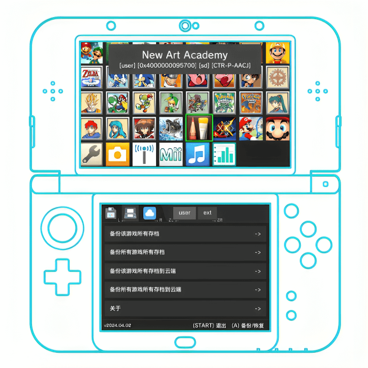

  

[中文](./README.md)/English

# Save Cloud for 3DS

> The backup tool for 3DS game saves that is compatible with naked-eye 3D effects

## Features

- Game saves backup (local/cloud)
- File Management (Local/Cloud)
- Supports calling FBI to install CIA files on cloud disk.
  - Requires special version of [FBI](https://github.com/save-cloud/FBI/tree/boot-args)
- ... etc.

## FBI Scan Code Installation

## Project structure

- 3ds sdk
  - Use [devkitPro](https://github.com/devkitPro)
- rust
  - Use [rust-3ds](https://github.com/rust3ds)
- USER INTERFACE
  - Use [dioxus v0.5.0](https://github.com/DioxusLabs/dioxus) as the UI framework.
    - Dioxus, as a cross-platform UI framework, does not support the 3DS platform, so to use it on 3DS, you need to implement custom rendering.
    - This project uses native-core + taffy, etc. to implement 3ds rendering.
    - Layout part, implement flex/block layout, default layout is `display: block`.
    - > Event part, implement keypress: `onkeypress`, touch screen input: `onclick`, `onmousedown`, `onmouseup`.
    - > Naked eye 3D part, use custom attribute `deep_3d` to define 3D depth, positive number is in screen, negative number is out of screen.
    - Top and bottom screen rendering, use custom attribute `screen` to define which screen to render on, `top`, `bottom`.
  - Use [citro2d](https://github.com/devkitPro/citro2d) for UI rendering.
- Networking
  - Use libcurl

## build

- `. /build`.
  - > If you need to build 3dsx, you need to implement [ `save_cloud_api`](. /src/api.rs)
  - or remove the `save_cloud_api` part.

## References

- 3ds homebrew SDK related
  - [devkitPro](https://github.com/devkitPro)
  - [libctru](https://github.com/devkitPro/libctru)
  - [3ds-examples](https://github.com/devkitPro/3ds-examples)
  - [citro2d](https://github.com/devkitPro/citro2d)
  - [rust-3ds](https://github.com/rust3ds)
  - [armv6k-nintendo-3ds](https://doc.rust-lang.org/rustc/platform-support/armv6k-nintendo-3ds.html)
- CIA build related
  - [3ds-homebrew-tips-and-tricks-ii](https://zalods.blogspot.com/2015/07/3ds-homebrew-tips-and-tricks-ii.html)
  - [banner tool](https://gbatemp.net/threads/bannertool-example.619783/)
  - [cia build example](https://github.com/skyfloogle/red-viper)
- 3ds wiki
  - [3ds title id](https://www.3dbrew.org/wiki/Titles)
  - [3dbrew](https://www.3dbrew.org/wiki/Main_Page)
- [3DS CFW Guide](https://3ds.hacks.guide/)
- [ssl cart](https://curl.se/docs/caextract.html)
