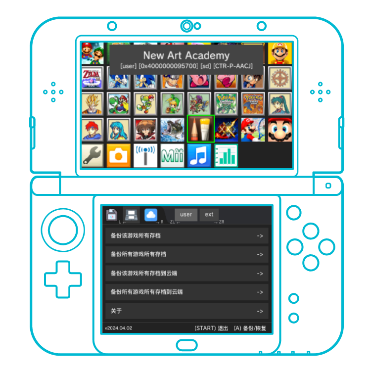

  

中文/[English](./README-EN.md)

# Save Cloud for 3DS

> 唯一一个适配了裸眼 3D 的 3ds 游戏存档云备份工具

## 功能

- 游戏存档备份（本地/云盘)
- 文件管理（本地/云盘)
- 支持调用 FBI 安装云盘 CIA 文件
  - 需要安装特定版本 [FBI](https://github.com/save-cloud/FBI/tree/boot-args)
- ...等

## FBI 扫码安装

## 项目结构

- 3ds sdk
  - 使用 [devkitPro](https://github.com/devkitPro)
- rust
  - 使用 [rust-3ds](https://github.com/rust3ds)
- UI
  - 使用 [dioxus v0.5.0](https://github.com/DioxusLabs/dioxus) 作为 UI 框架
    - > dioxus 作为跨平台 UI 框架，并没有对 3ds 平台的支持，所以要在 3ds 上使用, 需要实现 custom render
    - > 本项目使用了 native-core + taffy 等实现 3ds 的 render
    - > 布局部分实现 flex/block 布局，默认布局 `display: block`
    - > 事件部分，实现按键输入：`onkeypress`，触屏输入： `onclick` `onmousedown` `onmouseup`
    - > 裸眼 3D 部分，使用自定义属性 `deep_3d` 定义 3D 深度，正数为入屏，负数为出屏
    - > 上下屏幕渲染，使用自定义属性 `screen` 定义渲染在哪块屏幕，`top` `bottom`
  - 使用 [citro2d](https://github.com/devkitPro/citro2d) 作为 UI 渲染
- 网络
  - 使用 libcurl

## 构建

- `./build`
  - > 如果需要构建 3dsx，需要实现 [ `save_cloud_api`](./src/api.rs)
  - > 或者删除 `save_cloud_api` 相关部分

## References

- 3ds homebrew SDK related
  - [devkitPro](https://github.com/devkitPro)
  - [libctru](https://github.com/devkitPro/libctru)
  - [3ds-examples](https://github.com/devkitPro/3ds-examples)
  - [citro2d](https://github.com/devkitPro/citro2d)
  - [rust-3ds](https://github.com/rust3ds)
  - [armv6k-nintendo-3ds](https://doc.rust-lang.org/rustc/platform-support/armv6k-nintendo-3ds.html)
- CIA build related
  - [3ds-homebrew-tips-and-tricks-ii](https://zalods.blogspot.com/2015/07/3ds-homebrew-tips-and-tricks-ii.html)
  - [banner tool](https://gbatemp.net/threads/bannertool-example.619783/)
  - [cia build example](https://github.com/skyfloogle/red-viper)
- 3ds wiki
  - [3ds title id](https://www.3dbrew.org/wiki/Titles)
  - [3dbrew](https://www.3dbrew.org/wiki/Main_Page)
- [3DS CFW Guide](https://3ds.hacks.guide/)
- [ssl cart](https://curl.se/docs/caextract.html)
